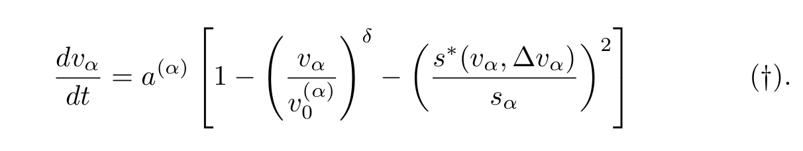
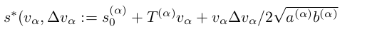
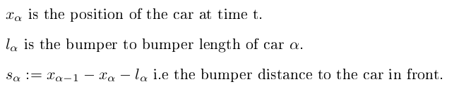
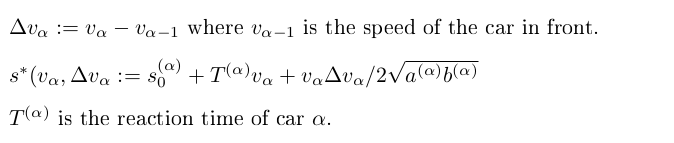
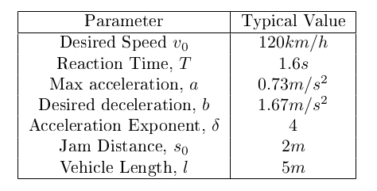

# Traffic Flow Simulation using the

# (I)ntelligent (D)river (M)odel

#### Date: 20/06/2022

## Introduction
The IDM model is a microscopic car following traffic flow model, which has been
implemented in C++ and visualized using Python with Pygame.


### Key Theory

The key idea for this model is that the acceleration of a car is dependent on the car in front.

If we denote the speed of car alpha to be v_a then the acceleration for car alpha is given by:



Where s* is given by:



With the parameters defined as follows:







This theory is taken from the paper:  ["Congested traffic states in empirical observations and microscopic simulations".](https://journals.aps.org/pre/abstract/10.1103/PhysRevE.62.1805)


We Implement these equations as follows:

```C++
float delta_v = getApproachRate();
float s = s0 + T*v + ((v * delta_v)/(2*sqrt(a*b)));
float bumpDist = getBumperDistance();  // Distance to next car
return a * (1 - pow((v/v0), delta) - (s/bumpDist)*(s/bumpDist));

```

For a more in depth look at the implementation, see the report pdf found in the docs section of this repo.

### Possible Improvements
- Read parameters from json/YAML.
- [MOBIL](https://traffic-simulation.de/info/info_MOBIL.html) Model for lane changing.
- More dynamic method for spawing road layouts.

